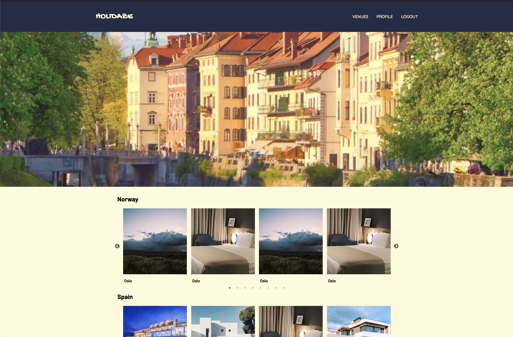

# Project Exam 2

## Holidaze



Holidaze is a holiday venue booking website developed for a school exam project. It features two main user stories: a customer-facing side where users can explore and book holiday venues, and a venue manager-facing side where users can register and manage their venues and bookings. The API used has been provided by Noroff.

### Notable features

- Browse venues,
- Search for venues,
- View a single venue,
- Registration is only possible with @stud.noroff.no email addresses,
- Log in with a registered user,
- Update avatar,
- Book a venue,
- Delete booking,
- Create a new venue,
- Edit a venue,
- Delete a venue,
- View venue bookings.

## Build with

This website is build with Vite, React and Tailwind CSS.

## Getting started

1. Clone this repository.

```
git@github.com:zalacop/Project-exam-2.git
```

You can run this application using your favorite server.

2. Install NPM packages

```
npm install
```

### Run the application

1. Start the development server

```
npm run dev
```

2. View in Browser
   Open the provided localhost link in your preferred web browser
